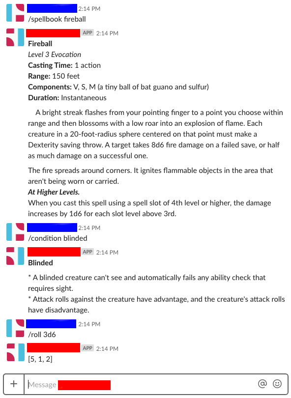

# dndtools
Slack app that provides slash commands for D&D 5E gamers. It contains three main user functions:
* /condition - gives the effects of the named condition, e.g., `/condition exhaustion`
* /roll - roll some dice, e.g., `/roll 3d6`
* /spellbook - get the text of the named spell, e.g., `/spellbook Fireball`

## Installation
### Prereqs
In order to make this work, you're absolutely going to need a slack channel where you can add and edit apps and slack commands. You can run the app on your own server, but it will also run in a serverless environment using AWS Lambda, S3, and DynamoDB.
### Getting Started
I recommend you use virtualenv to create a virtual environment for running this code and downloading all its dependencies. More info on virtualenv [here](https://packaging.python.org/guides/installing-using-pip-and-virtualenv/) if you're not familiar.
### Clone the repository to your local machine
`git clone https://github.com/gwrome/dndtools.git`
Change directories to wherever you cloned the repo, e.g., `cd dndtools`.
### Install the required libraries
Run `pip install -r requirements.txt` in the directory where you downloaded the repo.
### Initialize the database
#### In the cloud
If you're planning on using AWS for your DynamoDB, just make sure your AWS credentials file is up to date. The application relies on your AWS_ACCESS_KEY_ID and AWS_SECRET_ACCESS_KEYS being set as environment values in the execution environment.
#### Local DynamoDB
If you're planning to run the application locally, you're going to need to install a local DynamoDB server. You can get more information on that [here](https://docs.aws.amazon.com/amazondynamodb/latest/developerguide/DynamoDBLocal.html). you'll need to set a few environment variables to make things work locally:
* Set DYNAMO_ENABLE_LOCAL to True
* Set DYNAMO_LOCAL_HOST to localhost (or wherever you're hosting the DynamoDB server)
* Set DYNAMO_LOCAL_PORT to 8000 (or whatever port your server is running on)

Once you're ready to initialize the database, it's as easy as `FLASK_APP=dndtools.py flask init-db`

By default, the app uses the [srd-spells.json](dndtools/srd-spells.json) file to populate the database with spells. If you have custom spells in the same format, you can pass the `--infile <filename>` argument to `init-db` command, like so: `FLASK_APP=dndtools.py flask init-db --infile customfile.json`. The app also knows how to read the JSON file format used in the resources from [5e.tools](http://5e.tools), which are also [available on Github](https://github.com/TheGiddyLimit/TheGiddyLimit.github.io). If using a JSON file in that format, use the `--tools` flag: `FLASK_APP=dndtools.py flask init-db --infile <filename> --tools`.

### Deploy
I use Zappa to deploy my flask app to AWS Lambda. You can install it with `pip install zappa`. From the repo directory, just run `zappa init`, configure your new zappa_settings.json file as necessary, and then run `zappa deploy <stagename>` with your stage's name. More in-depth instructions can be found [here](https://renzo.lucioni.xyz/serverless-slash-commands-with-python/).

If you're running the app locally, you're already deployed.
### Set up Slack
TL;DR: you need to set up a slack app for your team and slash commands for this app. There's a great guide (with pictures!) to doing that [here](https://renzo.lucioni.xyz/serverless-slash-commands-with-python/).
### Set your Slack environment variables
No matter where you run the server, it needs to know your Slack verification token and your Slack Team ID. If running locally, you can set them as environment variables in the usual ways. If you're running the app in Lambda, you can set the environment variables in your lambda's configuration panel.
## Acknowledgements
Thanks to Renzo Luciono's great [tutorial on serverless slash commands](https://renzo.lucioni.xyz/serverless-slash-commands-with-python/). That's where this app started, and I couldn't have juggled all the pieces from the start without his guidance.

And thanks to GitHub user vorpalhex for packaging up the SRD's spells in a [handy JSON file](https://github.com/vorpalhex/srd_spells) that I've included with this repo.
## Open Gaming License Content
The contents of [srd-spells.json](dndtools/srd-spells.json) and the condition information in [condition.py](dndtools/condition.py) are used under the OLG. I have also included a copy of the relevant Open Gaming License in the repo in the ogl.html file. No other content in this repository is subject to the OGL.
